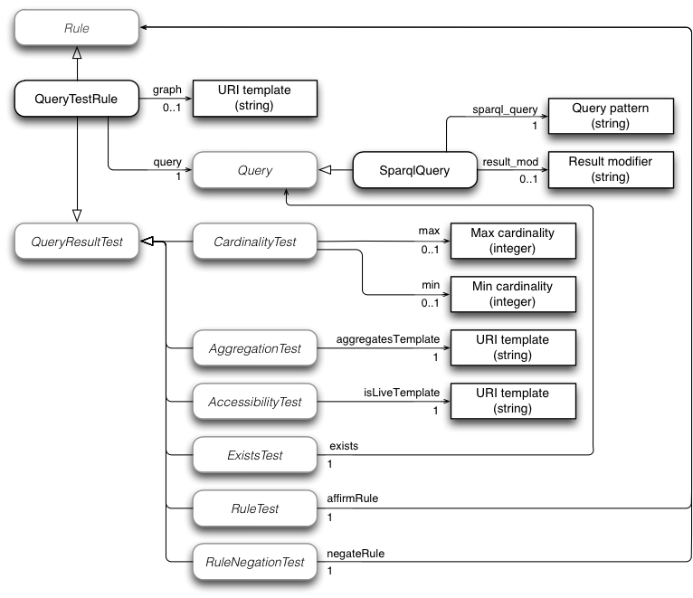
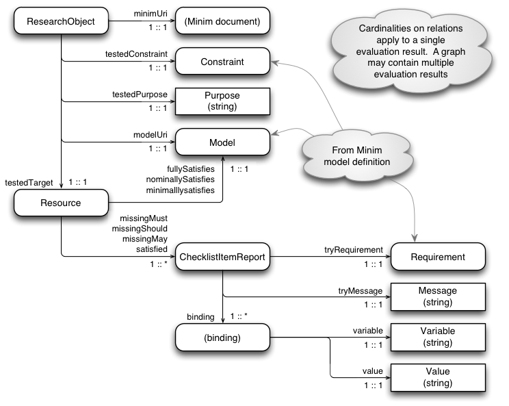

# Minim model for defining checklists

Minim is a model for defining _checklists_ for [Research Objects](http://www.researchobject.org/). A Minim model defines a list of MUST/SHOULD/MAY _requirements_, associated with _rules_ that express how to satisfy the requirement, e.g. by requiring certain resources to exist in the RO, or a more detailed _query_ that must be fulfilled in its annotations.

The Minim [ontology](http://purl.org/minim/minim), its [specification](minim-revised.md) and its [OWLDoc documentation](http://purl.org/minim/owldoc) are maintained in a [GitHub project](https://github.com/wf4ever/ro-manager/tree/master/Minim).

Please feel free to **contribute** by proposing changes as a [pull request](https://github.com/wf4ever/ro-manager/pulls) or a [raise an issue](https://github.com/wf4ever/ro-manager/issues).

Changes: This model has been significantly refactored and enhanced.  The enhancements provide a cleaner structure to the overall model, greater expressive capability (including value cardinality tests similar to those supported my MIM), and clear identification of extension points at which new capabilities can be added to the model.  The refactoring is done so that old-style Minim definitions do not conflict with new style definitions, and both may be supported in a single implementation.

The main elements of the Minim model are:

* __Checklists__ (or Constraints): Different models may be provided for different purposes; e.g. the requirements for reviewing an experiment may be different from those for a workflow to be runnable. A Minim `Checklist` associates a Minim `Model` with a description of the quality evaluation it is intended to serve.

    

* __Models__: a Minim `Model` defines a list of `Requirement`s to be satisfied, which may be mandatory (`hasMustRequirement`), desirable (`hasShouldRequirement`), or optional (`hasMayRequirement`).
* __Requirements__: these denote some requirement to be satisfied by a Research Object, such as the presence of certain information about an experiment, or additional critreria to be satisfied by the available data.  For example, we may wish to test not only that a suitable reference to input data is provided by an RO, but also that the data is live (accessible), or that its contents match a given value (integrity).

    

* __Rules__: a rule is associated with each requirement, and describes how the requirement is tested.  A small number of different rule types are currently supported by the checklist service, including tests of the local computing environment for presence of particular software, and tests that query a Ressearch Object and perform tests on the results obtained.  A rule determines whether a Research Object satisfies some technical requirement (e.g. that some specific resources are available, or accessible), which is interpreted as an indicator of some end-user goal.

    The main type of rule currently implemented is a `QueryTestRule`, which performs a query against the combined metadata (annotations) of an RO, and tests the result in various ways:

    

## Extension points

There are three classes defined by the Minim model that may be further subclassed to add new testing capabilities:

* `Rule`: new rule types can be introduced to perform tests for new kinds of requirement that cannot be handled within existing structures.  For example, if a workflow has a dependency on a particular kind of computing hardware environment, such as a particular model of quantum computing coprocessor, then new rule types might be introduced to cover tests for such things.
* `Query`: this is an extension point within `QueryTestRule`, which allows query types other than SPARQL to be introduced.  For example, a SPIN query processor, or an OWL expression used to find matching instances in the RO metadata might be introduced as different query types.  The model assumes that query results are returned as lists of variable-binding sets (e.g. lists of dictionaries or hashes).
* `QueryResultTest`: this is another extension point within `QueryTestRule`, which allows different kinds of test to be applied to the result of a query against the RO metadata.  For example, checking that a particular URI in the metadata is the access point for an implementation of a specific web service might be added as a new query result test.

Any such extensions would need to be supported by new code added to a checklist evaluation implementation.

# Minim results model for checklist evaluation results

The outcome of a checklist evaluation is returned as an RDF graph, using terms defined by the [Minim results model](http://purl.org/minim/results).  The result graph returned also includes a copy of the Minim description used to define the assessment, so should contain all information to create a meaningful rendering of the result.  The design is intended to allow multiple checklist results to be merged into a common RDF graph without losing information about which result applies to which combination of checklist, purpose and target resource.

The central values returned are the satisfaction properties (`missingMust`, etc.) that relate a target `Resource` with a Minim `Model` or the properties that relate a `Resource` to individual `ChecklistItemReport` (`satisfied`, `missingMust`, etc.).  Additional values are included so the result graph contains sufficient information to generate a meaningful user presentation of the checklist evaluation result.

The main result of a checklist evaluation is an indication of whether a target resource `fullySatisfies`, `nominallySatisfies` or ``minimallySatifies` a checklist, evaluated in the context of a particular research object.  `fullySatisfies` means that all MUST, SHOULD and MAY requirements are satisfied; `nominallySatisfies` means that all MUST and SHOULD requirements are satisfied, and `minimallySatifies` means that all MUSTrequirements are satisfied.  Thus, the satisfaction properties forkm a hierarchy.  If any MUST requirement is not satiusfied, then nine of the relations hold between the target resource and thge checlist.

A breakdown of the checklist evaluation result is given by a number of `missingMust`, `missingShould`, `missing Masy` and/or `satisfied` properties, which indicate the evaluation result for each individual checklist item as a relationship between the target resource and the corresponding checklist requirement.  Associated with each of these individual item results is a message string which gives an explanation of the outcome of the test for that item.  Also associated with the result for each checklist item there may be one or more variable bindings which may provide more detailed information about the reason for success or failure of the test.  Typically, the values are associated with the result of a query performed against the Research Object.  For example, a test for liveness of workflow inputs may use a query to find the workflows and associated inputs, and a test for liveness of an input is performed for each result of that query;  when one of those inputs is found to be not accessible, the corresponding query result variables are returned as part of the checklist item result.

This is an example Minim requirement that tests for presence of a synonym in chembox data:

    :Synonym a minim:Requirement ;
      minim:isDerivedBy
        [ a minim:QueryTestRule ;
          minim:query
            [ a minim:SparqlQuery ;
              minim:sparql_query "?targetres chembox:OtherNames ?value" ;
            ] ;
          minim:min 1 ;
          minim:showpass "Synonym is present" ;
          minim:showfail "No synomym is present" ;
        ] .

This returns the following (partial) result for a target resource `http://purl.org/net/chembox/N-Methylformamide` for which no synonym exists:

    <http://purl.org/net/chembox/N-Methylformamide>
        minim:minimallySatisfies :minim_model ;
        minim:nominallySatisfies :minim_model ;
        minim:missingMay
            [ minim:tryMessage "No synomym is present" ;
                minim:tryRequirement :Synonym ;
                result:binding
                    [ result:variable "targetres" ; 
                      result:value "http://purl.org/net/chembox/N-Methylformamide" ],
                    [ result:variable "query" ;     
                      result:value "?targetres chembox:OtherNames ?value" ],
                    [ result:variable "min" ;       result:value 1 ],
                    [ result:variable "_count";     result:value 0  ]
            ] .

The variable bindings here provide information about the failed checklist item test, icnluding the target resource, the failed query, the number of query matches, etc.

# Checklist results presentation

The basic checklist evaluation servioce provides rather detailed information about the result of the evaluation.  For many applications, the desired outcome is presentation to a user of a result summary, and this detailed information can be quite tricky to decide.   Further, many such web applications may not have RDF handling capabilities.

In order to make life easier for such clients of the checklist service, a "wrapper" is provided, accessed using different endpoint URIs, that analyzes a checklist result graph and returns a simple HTML or JSON formatted result that can be used to create a simple "traffic light" display, e.g. like this:

# References

[CHECKLIST]: http://www.ncbi.nlm.nih.gov/pubmed/16990087 (B. Hales and P. Pronovost, “The checklist-a tool for error management and performance improvement”, Journal of critical care, vol. 3, no. 21, pp. 231-235, 2006.)

[MIBBI]: http://www.nature.com/nbt/journal/v26/n8/pdf/nbt.1411.pdf (C. Taylor, D. Field, S. Sansone, J. A. R. Aerts, A. M., B. P. Ball C.A., M. Bogue and T. Booth, “Promoting coherent minimum reporting guidelines for biological and biomedical investigations: the MIBBI project”, Nature biotechnology, vol. 8, no. 26, pp. 889-896, 2008.)

[MIM]: http://dx.doi.org/10.1109/eScience.2012.6404489 (Matthew Gamble, Jun Zhao, Graham Klyne, Carole Goble. "MIM: A Minimum Information Model Vocabulary and Framework for Scientific Linked Data", IEEE eScience 2012 Chicago, USA October, 2012)

[MIM-spec]: http://purl.org/net/mim/ns (Minimum Information Model Vocabulary Specification)

[Minim-OWL]: http://purl.org/minim/ (Minim ontology)

[Minim-results]: http://purl.org/minim/results (Model for Minim-based checklist evaluation results)

[Minim-spec]: https://github.com/wf4ever/ro-manager/blob/develop/Minim/minim-revised.md (Minim checklist description)

[Minim-owldoc]: http://purl.org/minim/owldoc (Minim ontology OWLDoc documentation)

[WF-decay]: http://users.ox.ac.uk/~oerc0033/preprints/why-decay.pdf (Zhao J, Gómez-Pérez JM, Belhajjame K, Klyne G, García-Cuesta E, Garrido A, Hettne K, Roos M, De Roure D, Goble CA, "Why Workflows Break - Understanding and Combating Decay in Taverna Workflows", 8th IEEE International Conference on e-Science (e-Science 2012).)

